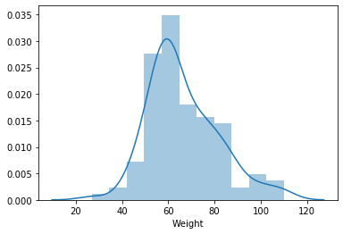

## What is evidence based practice

Case scenario:
- Solo living old woman
- Depression
- In home:
 - Background music
 - She recently started listening to music
 - She started yoga
 - Started muscle relaxation technique plus medication
 - The doctor prescribed these on the basis of systematic review
 
## Definition of evidence based practice

> Conscientious, explicit, judicious use of current best evidence in making decisions about the care of individual patients

## Triad approach
- Best research evidence
    - Highest level of evidence
    - Level 1: highest (Meta-analysis/SR of RCT)
    - Level 5: lowest (anecdote)
- Clinical expertise
    - Your personal knowledge 
    - Your experience
- patient values
    - Patient preference
    - Patient values
    - Cultural issues
    
## Definition of research
> Focused systematic enquiry aimed at generating new knowledge

## Sacket and Haynes approach to EBP
AAAAE:
- Ask: convert information needs to answerable questions
- Acquire: identify best evidence
- Appraise: Assess validity and usefulness
- Apply: Implement the appraisal in (clinical) or regular practice
- Evaluate: Evaluate performance

- Read right papers in right time
- Alter your behaviours
- Influence behaviours of others

## Greenhalgh's context sensitive checklist:
[] Have you identified and prioritised the clinical, psychological, social problems taking into account the patients/client's perspectives?
[] Have you performed examination of the patient/client to establish competing diagnoses?
[] Have you considered additional problems and risk factors that will need opportunistic attention?
[] Have you sought evidence pertaining to problems?
[] Have you applied valid and relevant evidence to this PARTICULAR set of problems
[] Have you presented the pros and cons of different options to the patient/client in a way they can understand and incorporatted the patient's preference into the final recommendation?
[] Have you arranged review, recall, referral or further care as necessary?

## Greenhalgh and Donald's definition
> Use of mathematical estimates of the risk of benefit and harm, derived from high quality research on population samples, to inform clinical decision-making in the diagnosis, investigation or management of individual patients

## Apprehensions
- It is NOT all about stats but stats is necessary to under the processes
- Lots of buzzwords and new expressions but you can break them down to boiler plate words

## Non evidence-based practice examples
- Decisions by anecdote
    - Example: Eminent practitioners 'remember' what they did to similar patients/clients
    - Individual stories are important to understand the 'meaning'
    - But applying what worked for B to A where A and B are different in many ways is fallacious
- Copy pasting
    - Example: 'If it is in print, it must be correct'!
    - Very common approach for misinformation ('probiotics improve your mood', 'measles vaccination causes autism')
    - Articles that are not peer-reviewed or vetted may contain inaccurate or invalid information, always appraise and apply the AAAAE or Greenhalgh's checklist
- Expert opinion
    - Example: 'Professor X knows therefore it must be correct'
- Cost based
    - 'If it is expensive or costly, must be good'
    
## Frame the problem

Problem: "Mrs X wants to know the most effecive non-evasive and non-pharmacological pain management technique during labour, what is the bet best option?"

- Many students might not know where to start
- Experts may provide opinions based on their personal experience

## Sackett's checklist:
- Define precisely _whom_ the question is about (ask, "How would I describe a group of patients similar to the one I am taking care of)
- Define _which_ intervention you are considering and _which_ is the control condition
- Define the _outcome_ that are both desirable and undesirable (benefits and harms)

## Reframe the problem:
> In a 30-year old white woman with high pain threshold with two previous birthing experiences, no coexisting illness, no significant medical history, would the benefits of massage and reflexology provide with Ms Janes the desired outcome during labour?

Before you advise, seek Mrs. X's preferences and how much pain reduction would be meaningful for her. 

## Barriers to translation of research evidence
- Lack of time
- Lack of facilities
- Lack of searching skills
- Lack of motivation
- Information overload

## Challenge
> How do you remain knowledgable about current relevant research in your area of practice?

- Textbooks are favoured over journals
- Internet use has expanded 'dramatically'
- Many users are not IT literate
- Many blindly search Google for information

## Why will you search for evidence?
- Recreational surfing for information
    - Use 'journal alert services'
    - Subscribe to journal or source or blog RSS feeds
    - Set up a Google Alert for search terms
    - Set up Twitter feeds
    - Create groups in Twitter
- Focused looking for answers
    - Detailed search
    - Know when to start and stop looking for answers
- Survey existing literature
    - Clarify gaps in knowledge
    - One database but better with more databases
    - Citation chaining
    - Do with Information specialists
    
# Primary and secondary research
- Single research study: primary research
- Finding primary sources:
    - Reference lists from articles
    - Hyperlinks from secondary sources
    - Journal alerts
    - Database search:
    - Pubmed/Medline
    - Google
    - Embase
    - Pascal
    - UC library
    - Cochrane
    - CINAHL
    - Web of Science
    - Scopus
    - Google Scholar
- Secondary
    - Synthesised findings
    - Literature review
    - Meta-analysis
    - They involve multiple research papers
    - Summaries of research papers
    - Combine findings from a number of research papers

## How to construct effective search strings
- [Pubmed](http://www.pubmed.gov)
- Use boolean operators (AND/NOT/OR) to search pubmed rather than random combinations of words
- Challenge:
> Pregnant client asks: "Is hyponsis a useful form of pain reflief in labour?"

- See the results from 'hypnosis' 'pain relief' 'labour' in Google search, you will get
https://scholar.google.co.nz/scholar?hl=en&as_sdt=0%2C5&q=hypnosis+pain+relief+labour&btnG=

- See the results from the same search on Pubmed:
https://www.ncbi.nlm.nih.gov/pubmed/?term=%27pain+relief%27+AND+%27hypnosis%27+AND+%27labour%27

- See the results of a simple search with OR in it
https://www.ncbi.nlm.nih.gov/pubmed/?term=%27pain+relief%27+OR+%27hypnosis%27+OR+%27labour%27

- Search results using truncation
- What do we get if we use hypno*
https://www.ncbi.nlm.nih.gov/pubmed/?term=%27pain+relief%27+AND+hypno*+AND+%27labour%27
- Make it more relevant by using Boolean operator NOT
- Results when we use NOT(hypnoanalysis OR hypnotic)
https://www.ncbi.nlm.nih.gov/pubmed/?term=%27pain+relief%27+AND+hypno*+AND+%27labour%27+NOT(hypnoanalysis+OR+hypnotic)

- Use the wildcard '?' to search for alternative spelling conventions
- Results when we search for randomised OR randomized trials

- In [Google Scholar](https://scholar.google.com), use 'citation tracking'. The following is an example of tracking citations for all studies that had 'smoking cessation' in Google Scholar for the first search:

https://scholar.google.co.nz/scholar?cites=16458925538307874084&as_sdt=2005&sciodt=0,5&hl=en

- Use filters to filter through your search. Example: in Pubmed, we have used a filter to search for all English language studies on 'smoking cessation'

- https://www.ncbi.nlm.nih.gov/pubmed/?term=smoking+cessation

See how the images are applied:


- Federated search engines
    - [TRIP Database](http://www.tripdatabase.com/)
    - Searches multiple resources and databases
Link to a useful exercise
https://www.cebm.net/2013/06/searching-exercise-warm/

## Reviewing literature

## The BMJ article: https://www.bmj.com/content/342/bmj.c5347
A related article that discusses vaccination autism scandal, https://journals-sagepub-com.ezproxy.canterbury.ac.nz/doi/abs/10.1345/aph.1Q318
(Use it for our journal club in the class to discuss this or use it for second assignment commentary)

## How to read  research paper
- What to look for:
    - Results (what are the results?)
    - Validity (Do the results match conclusions?)
    - Applicable (Are the results applicable to my own patients/clients?)
- IMRAD format 
    - Introduction (_why_ they did the study)
        - Background to the problem
        - Literature review
    - Methods (_how_ they did the study)
        - Most important part for you to understand
    - Results (_what_ did they find)
    - Discussion (_so what_ does it mean)
        - Conclusions
# Five questions you must ask:
- Who wrote the paper?
    - Check conflicts of interest (which company sponsored the study)
    - Who invented or designed the intervention themselves that they are writing about?
- Is the title and abstract appropriate?
    - Title must tell you:
        - Topic, population, and method (Example: "Effectiveness of nicotine chewing gum for smoking cessation among teenage smokers: results of a randomised controlled trial")
        - Abstract must SUMMARISE the paper
        - Reading the abstract you must be able to decide whether it is worthwhile to read further
        - Abstract must include:
            - What the study is about (some background)
            - How the study was conducted
            - What are the findings or at least main findings
         - If these bits are not present, then the article may not be much worth reading.
- What is the research design and is the research design appropriate for the study question?
    - Is it a primary study (i.e., the authors themselves conducted the study)
    - Is it a secondary study (i.e., the authors synthesised information from two or more other papers?): systematic reviews or meta-analyses, or other reviews
    - If it is a primary study what is the study design?
    - Is the study design appropriate for the problem being studied (e.g., if they are evaluated an intervention, did they conduct a randomised controlled trial or another appropriate intervention study?)
- What is the research question and why was the study needed to be done?
    - First part (first paragraph) should set the context or the brief introduction to the work
    - Next, a brief review of the relevant literature and studies
    - After stating the general idea and what is known about the topic in the literature, it must point out the specific gap that this study would fill in
    - Finally, the research goal and objectives before diving in to the methods section
    
- What are the results and whether the results answer the questions posed?
    - results of a study should clearly answer the question or aim originally posed by the authors
    - discussion/conclusion then relates these back to the literature
    - This section must discuss limitations/weaknesses of the study
    
## How to assess methods of the study
- Sample and setting
    - Who was included in the study?
    - Who was excluded from the study?
    - How and why did the researchers decide this?
    - How were the participants recruited?
    - Where did the study occur?
    - How was ethical clearance obtained? If not reported, why not?
    - What special care apart from the intervention did the participants receive?
- What data collection methods were used?
    - What data was collected?
    - Who collected the data?
    - How was the data collected?
    - If they used a questionnaire or tool or instrument, how was the tool validated?
    - What outcome was measured?
    - How did the investigators avoid or minimise biases?
- How was the data analysed?
    - How large was the study?
    - How long did they decide to continue the study?
    - What was the follow up procedure?
    - How did the authors blinded or masked themselves to avoid bias (performance bias)?
    - Are the results statistically significant AND clinically or substantively significant?
    - If they were reporting qualitative data, did the researchers describe the phenomenon fully?
    - What or how did the researcher examine their own assumptions?
    - How did the researchers explain their themes, structures, and processes?
    - What validation techniques were used by the researchers?
    - What participant quotations were used to support this?
    
## How to assess review papers?
- In evidence based practice (EBP), we are concerned mostly with systematic reviews or meta analysis
- Check the PRISMA statement article here: 
https://www.ncbi.nlm.nih.gov/pubmed/19621072

## Questions to ask and assess about systematic reviews/MAs
- What is the clinically or relevant focused question?
    - The researcher MUST define the question very precisely
- How thorough was the literature search?
    - Must use more than one database
    - How did they search for grey literature? Grey literature refers to those studies that have not been published but written up or results are otherwise available
    - What exclusion and inclusion criteria were used?
    - How faithfully were the exclusion and inclusion criteria followed?
- Who evaluated the studies?
- How were independent reviewers assess quality of the studies and extract results or data from them? What happened in case of conflicts?
- How did the researchers measure effects? What measures were used?
- How did the researchers conduct risk of bias analysis? HOw did they minimise risk of bias?
- What did the reviewers do if data were missing from some study?
- How did the reviewers address study homogeneity?
- How did they conduct sensitivity analyses?
    - What would happen if the inclusion or exclusion criteria were altered?
    - What would happen with studies of different quality scores?
    - How did they deal with publication bias?
    - If this was a meta analysis, did the authors conduct meta-regression, and if so, how did they do so?
- How did the authors inpterpret the findings from the individual studies?
- How well did the authors relate to the external validity of the findings or applicability to a wider situation?

## How to assess qualitative research

- Did the paper describe an important clinical problem addressed via a clearly formulated question?
    - Why did they conduct the research and what specific question did they ask?
- Was the qualitative research an appropriate method?
    - Did they explore or interpret or attempt to obtain a deeper understanding that would not be possible with numeric data?
- How did they select the subjects and the setting?
    - Did they 'deliberately seek out individuals or groups who fit the bill'? This is important in qualitative research, while random sampling is important in quantitative research
    - Watch out for qualitative research where the sample has been selected (or appears to have been selected) purely on the basis of convenience
- What was the researcher's perspective and was that taken into account?
    - It is important to recognise that there is no way of fully controlling for observer bias in qualitative research.
- What methods did the researcher employ to collect data? How detailed was it?
    - methods section of a qualitative paper often cannot be written in shorthand or dismissed by reference to someone else’s research techniques
    - ‘Have I been given enough information about the methods used?’, and, if you have, use your common sense to assess, ‘Are these methods a sensible and adequate way of addressing the research question?’

- How did the researcher analyse the data?
    - qualitative interpretation is often open to interpretation with ambiguities throughout the data and between the interpreters of the data, and this is perfectly normal as it is subjective in nature
- Are the results credible and clinically or substantively important?
    - determine whether the results are sensible and believable, and whether they matter in practice, is plain common sense
    - check is whether the authors cite actual data
- What conclusions were drawn and were they justified by results?
    - ask whether the interpretation placed on the data accords with common sense and that the researcher’s personal, professional and cultural perspective is made explicit so the reader can assess the ‘lens’ through which the researcher has undertaken the fieldwork, analysis and interpretation
    - How well does this analysis explain why people behave in the way they do?
    - How comprehensible would this explanation be to a thoughtful participant in the setting?
    - How well does the explanation cohere with what we already know?
- Are the findings of the study transferable to other settings?
    - The more the research has been driven by this kind of progressive focusing and iterative data analysis, the more its findings are likely to be transferable beyond the sample itself.
    
    

## Quantitative research

- Intervention studies
    - Experimental study designs
    - Randomised controlled trials
    - PICO system
    - Case series is a NON-experimental study design
- Observational studies
    - Descriptive research
    - Diagnostic accuracy studies
    - Epidemiological research
        - Cohort studies
        - Case control studies
        - Prospective studies
        - Retrospective studies
        - Cross-sectional surveys
        - Longitudinal studies
- Systematic reviews
    - Seek them for understanding a topic
- Meta analysis

## Measurement issues
- Levels of measurement (scale of measurement, as measurement level aka scale)
    - Nominal
    - Ordinal
    - Interval
    - Ratio
- Variables
    - Independent (experimental research)
        - Treatment/Placebo
        - These are nominal variables
    - Dependent (experimental research)
        - Refers to outcome measure
        - Could be categorical/continuous
        - Mnemonic: of/on, 'effect _of_ treatment _on_ the outcome'
- Reliability
    - Reliability: consistency of repeated measurement
    - Either the person or the thing remains _unchanged_, or _stable_ over repeated measurements
    - Types
        - Intra-rater: Repeated measurement of the same thing by the same person (ex: doctor measuring blood pressure of the same patient using the same cuff repeatedly)
        - Inter-rater: Measurement of the same thing by Two or More people (ex: two doctors measuring the blood pressure of the same patient using the same cuff)
        - Test-retest: Repeated measurement of the same thing over time by the same person (ex: doctors taking the same test over six months' difference)
        - Alternate/Parallel forms: Separate measurement of the same thing by two different _instruments_ by the same person or different persons (ex: doctor measuring weight of the patient using electronic weighing scale and analog weighing scale)
- Validity
    - Accuracy of measurements
    - Accuracy != consistency
    - whether a test really does measure what it claims to measure (ex: do intelligence tests only measure intelligence? or do they also measure culture?)
    - Construct validity: construct = idea/concept
    - Content validity: everything or partial to items that make up the construct (ex: reading, writing and numeracy measured as content for measuring literacy as a construct)
    - Face validity: appearance of what it is supposed to measure (ex: wordings of the items it measures)
    - internal consistency: the extent to which the items included in the instrument measure the same construct. This is assessed with Cronbach's alpha statistic
    - if a test is valid, it must be reliable
    - If a test is unreliable, it must be invalid
    - Measurement validity = Internal validity + external validity (generalisability)

# Levels of evidence
## Finding the best evidence:
- NHMRC system of evidence based practice
    1. Clinical Question: For any clinical problem, such as post-operative care for knee replacement, there is a clinical question and a way to answer that question through research.
        - How effective is the treatment? Look up intervention study or trials
        - How accurate is the assessment/diagnostic procedure? Look up diagnostic studies
        - What environmental/lifestyle/genetic factors lead to diseases? Look up aetiological studies or epidemiological research
        - How does the disorder/health condition progress untreated? Prognostic study or longitudinal study of untreated people
        - Will people be helped or harmed by community wide testing for this condition? Screening intervention study: (1) test a large number of people without signs/symptoms. If the screening test suggests presence of a condition, measure follow up procedures to test whether it leads to benefits or harm
    2. Level of evidence. Some research designs offer better protection against bias than other designs. Superior designs are assigned a higher level of evidence. Research at a higher evidence level is preferred for guiding practice.

Table of the level of evidence (see explanations and notes for details)

| Level | Intervention   | Diagnostic         | Aetiological   | Prognostic     | Screening      |
|-------|----------------|--------------------|----------------|----------------|----------------|
| I     | SR of Level II | SR of level II     | SR of Level II | SR of Level II | SR of level II |
| II    | RCT            | IBC against gold   | Prosp Cohort   | Prosp Cohort   | RCT            |
| III-1 | Pseudo RCT     | IBC against ref    | All or none    | All or none    | Pseudo RCT     |
| III-2 | Conc controls  | Comp with ref      | Retro cohort   | Analysis       | Conc controls  |
| III-3 | No conc ctrls  | Dx Case control    | Case control   | Retro cohort   | No conc ctrls  |
| IV    | Case series X  | Dx yield           | X-sect/Series  | Case Series/coh| Case series    |

Explanations and notes:
1. SR = Systematic review
2. RCT = Randomised controlled trial
3. IBC against gold = Independent blinded comparison against valid reference standard; consecutive presentation
4. Prosp Cohort = Prospective cohort study
5. Pseudo RCT = Pseudo-randomised controlled trial with concurrent control; not quite properly randomised
6. IBC against ref = Independent blinded comparison against another test of proven accuracy; without consecutive presentation
7. All or none = All or none study — all people exposed to the hazard have the disorder; none who are protected have it
8. Conc controls = Comparative study with concurrent controls; non-randomised allocation to treatment and control conditions
9. Comp with ref = Comparison with reference standard below criteria for Level II or Level III-1
10. Retro coort = Retrospective cohort study
11. Analysis = Analyse prognostic factors among persons from a single group of a randomised controlled trial
12. No conc ctrls = Comparative study without concurrent controls; non-randomised
13. Dx case control = Diagnostic case control studies
14. Case control = Case control studies
15. Case series X = Case series, post-test only or pre-test with post-test on planned outcomes
16. Dx yield = Diagnostic yield, no reference test
17. X-sect/Series = Cross sectional study or case series
18. Case Series/coh = Cases series or cohort study; persons at different stages of disease
19. Case series = Case series study

# Bias and validity

# Grading of evidence

# Levels of evidence vs hierarchy of evidence

# Statistics
- You do not need to be able to build a car to drive one
- What is the best test to use for statistical questions
- Ask: have the authors used any statistical tests at all? (If the authors have produced numbers but do not present stats tests, this could be problematic)
## Story:
During the 1990s, Professor John Eccleston and Dr Richard Wilson at the University of Queensland ran a simple randomised controlled trial with 110 students in their classes. The students began by measuring and recording their own pulse rates. Then, by coin toss each student was randomly allocated to one of two groups. Tossing heads on the coin meant the students had to run on the spot for one minute. Students throwing tails were asked to sit for one minute instead of running. Pulse rates were again recorded after the one minute of running or sitting. Running for a minute served as a treatment and sitting as a control condition, with pulse rate the outcome measure. Background data about the students such as their weight, height, gender, smoking, alcohol consumption and frequency of exercise were added to the running or sitting and pulse rate information for each student.1 Using these data we can test the effect of brief exercise and student characteristics on immediate heart rate. The advantage of this informal experiment is that we can easily predict its main findings. Everyone knows the effect of sudden physical activity on immediate heartbeat
Link: [story](http://www.statsci.org/data/oz/ms212.html)


```bash
%%bash
# get the data
# -O saves the content to the file specified
# -o saves the log
wget "http://www.statsci.org/data/oz/ms212.txt" -O mydata.tsv

```

    --2019-07-13 10:21:16--  http://www.statsci.org/data/oz/ms212.txt
    Resolving www.statsci.org (www.statsci.org)... 128.250.252.80
    Connecting to www.statsci.org (www.statsci.org)|128.250.252.80|:80... connected.
    HTTP request sent, awaiting response... 200 OK
    Length: 3311 (3.2K) [text/plain]
    Saving to: ‘mydata.tsv’
    
         0K ...                                                   100%  525M=0s
    
    2019-07-13 10:21:16 (525 MB/s) - ‘mydata.tsv’ saved [3311/3311]
    


```python
import pandas as pd
import numpy as np
import matplotlib.pyplot as plt
import seaborn as sns
```


```python
mydata = pd.read_csv("mydata.tsv", sep = "\t")
mydata.head()
```


<div>
<style scoped>
    .dataframe tbody tr th:only-of-type {
        vertical-align: middle;
    }

    .dataframe tbody tr th {
        vertical-align: top;
    }

    .dataframe thead th {
        text-align: right;
    }
</style>
<table border="1" class="dataframe">
  <thead>
    <tr style="text-align: right;">
      <th></th>
      <th>Height</th>
      <th>Weight</th>
      <th>Age</th>
      <th>Gender</th>
      <th>Smokes</th>
      <th>Alcohol</th>
      <th>Exercise</th>
      <th>Ran</th>
      <th>Pulse1</th>
      <th>Pulse2</th>
      <th>Year</th>
    </tr>
  </thead>
  <tbody>
    <tr>
      <th>0</th>
      <td>173</td>
      <td>57.0</td>
      <td>18</td>
      <td>2</td>
      <td>2</td>
      <td>1</td>
      <td>2</td>
      <td>2</td>
      <td>86.0</td>
      <td>88.0</td>
      <td>93</td>
    </tr>
    <tr>
      <th>1</th>
      <td>179</td>
      <td>58.0</td>
      <td>19</td>
      <td>2</td>
      <td>2</td>
      <td>1</td>
      <td>2</td>
      <td>1</td>
      <td>82.0</td>
      <td>150.0</td>
      <td>93</td>
    </tr>
    <tr>
      <th>2</th>
      <td>167</td>
      <td>62.0</td>
      <td>18</td>
      <td>2</td>
      <td>2</td>
      <td>1</td>
      <td>1</td>
      <td>1</td>
      <td>96.0</td>
      <td>176.0</td>
      <td>93</td>
    </tr>
    <tr>
      <th>3</th>
      <td>195</td>
      <td>84.0</td>
      <td>18</td>
      <td>1</td>
      <td>2</td>
      <td>1</td>
      <td>1</td>
      <td>2</td>
      <td>71.0</td>
      <td>73.0</td>
      <td>93</td>
    </tr>
    <tr>
      <th>4</th>
      <td>173</td>
      <td>64.0</td>
      <td>18</td>
      <td>2</td>
      <td>2</td>
      <td>1</td>
      <td>3</td>
      <td>2</td>
      <td>90.0</td>
      <td>88.0</td>
      <td>93</td>
    </tr>
  </tbody>
</table>
</div>


```python
%matplotlib inline
# distribution of the weight
mydata['Weight'].hist()
```


```python
sns.distplot(mydata['Weight'])
```


    <matplotlib.axes._subplots.AxesSubplot at 0x7f5bd518d5f8>





The plot above shows a slight skewness to the right. 


```python
## Descriptive statistics
wt_mean = mydata['Weight'].mean().round(2)
wt_sd = mydata['Weight'].std().round(2)
ht_mean = mydata['Height'].mean().round(2)
ht_sd = mydata['Height'].std().round(2)
```


    16.08


## Descriptive statistics
| Variable | Mean | SD |
|----------|------|----|
| Height   | 171.58 | 16.08 |
| Weight  | 66.33 | 15.16 |


```python
from IPython.display import Markdown
wt_mean = mydata['Weight'].mean().round(2)
wt_sd = mydata['Weight'].std().round(2)
ht_mean = mydata['Height'].mean().round(2)
ht_sd = mydata['Height'].std().round(2)
age_mean = mydata['Age'].mean().round(2)
age_sd = mydata['Age'].std().round(2)

Markdown("""
## Descriptive statistics
| Variable | Mean | SD |
|----------|------|----|
| Weight (kg)  | {meanwt}     | {wt_sd}  |
| Height (cm)  | {mnht} | {sdht} |
| Age (years)     | {agem} | {agesd} |

""".format(meanwt = wt_mean, wt_sd = wt_sd, mnht = ht_mean, sdht = ht_sd, agem = age_mean, agesd = age_sd))
```


## Descriptive statistics
| Variable | Mean | SD |
|----------|------|----|
| Weight (kg)  | 66.33     | 15.16  |
| Height (cm)  | 171.58 | 16.08 |
| Age (years)     | 20.56 | 3.92 |


# Mixed methods research

# Evidence into practice
